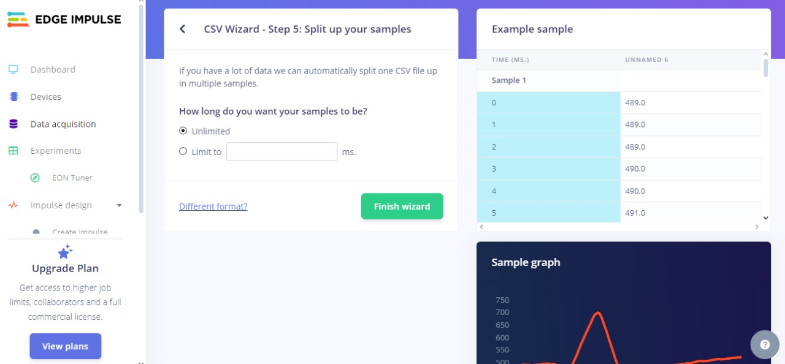

# Laboratorio de Edge Impulse 

## Tabla de Contenidos

1. [Introducción](#1-introducción)
2. [Objetivos](#2-objetivos)
3. [Metodología](#3-metodología)
4. [Resultados](#4-resultados)


## 1. Introducción

Edge Impulse es una plataforma enfocada en la creación de algoritmos de aprendizaje automático diseñados para ejecutarse eficientemente en dispositivos embebidos y sistemas que operan en tiempo real. Su enfoque principal es simplificar todo el proceso, desde la adquisición y preprocesamiento de datos hasta el entrenamiento y despliegue de modelos optimizados para hardware de bajo consumo.

Esta herramienta es especialmente valiosa para proyectos que involucran el análisis de señales biomédicas como el ECG, donde la precisión y la velocidad en el procesamiento son esenciales. Edge Impulse permite implementar soluciones para el monitoreo continuo y el diagnóstico, facilitando la integración de machine learning en aplicaciones médicas avanzadas.

Este informe aborda el proceso completo de adquisición de datos y su posterior integración en la plataforma Edge Impulse, estableciendo las bases para el desarrollo de un proyecto integral. Se describirán detalladamente las etapas involucradas, desde la captura inicial de señales hasta la configuración y entrenamiento del modelo, con el objetivo de optimizar su desempeño en sistemas embebidos y resaltar la eficacia de esta herramienta para el análisis en tiempo real de datos biomédicos.

<div align="center">
    <p>

  *Figura 1. Página inicial Edge Impulse*
  </p>
</div>

## 2. Objetivos
-Adquirir y estructurar señales de ECG

-Preprocesamiento y etiquetado inicial

-Organización en Edge Impulse

-Desarrollo y entrenamiento del modelo

-Pruebas de validación del modelo

-Adaptación para sistemas embebidos

## 3. Metodología


Se utilizo el siguiente codigo para guardar segmentos de 10 segundos de las señales de ECG adquiridas.
      ```
      
    import numpy as np
    import csv
    import os
    
    # Establece la frecuencia de muestreo (Hz)
    Fs = 1000  # Frecuencia de muestreo (Ejemplo: 1000 Hz)
    segment_duration = 10  # Duración de cada segmento en segundos
    samples_per_segment = Fs * segment_duration  # Número de muestras por segmento
   
    # Ruta de los archivos .txt
    file_paths = [
       "D:\\INTRO_SEÑALES\ECG_EDGEIMPULSE\\basald1.1.txt",
       "D:\\INTRO_SEÑALES\ECG_EDGEIMPULSE\\basald1.2.txt",
       "D:\\INTRO_SEÑALES\ECG_EDGEIMPULSE\\basald1.3.txt",
       "D:\\INTRO_SEÑALES\ECG_EDGEIMPULSE\\basald2.txt",
       "D:\\INTRO_SEÑALES\ECG_EDGEIMPULSE\\basald2.2.txt",
       "D:\\INTRO_SEÑALES\ECG_EDGEIMPULSE\\basald2.3.txt",
       "D:\\INTRO_SEÑALES\ECG_EDGEIMPULSE\\basald3.txt",
       "D:\\INTRO_SEÑALES\ECG_EDGEIMPULSE\\basald3.2.txt",
       "D:\\INTRO_SEÑALES\ECG_EDGEIMPULSE\\basald3.3.txt",
       "D:\\INTRO_SEÑALES\ECG_EDGEIMPULSE\\ejerciciod1.txt",
       "D:\\INTRO_SEÑALES\ECG_EDGEIMPULSE\\ejerciciod2.txt",
       "D:\\INTRO_SEÑALES\ECG_EDGEIMPULSE\\ejerciciod3.txt",
       "D:\\INTRO_SEÑALES\ECG_EDGEIMPULSE\\respd1.1.txt",
       "D:\\INTRO_SEÑALES\ECG_EDGEIMPULSE\\respd1.2.txt",
       "D:\\INTRO_SEÑALES\ECG_EDGEIMPULSE\\respd1.3.txt",
       "D:\\INTRO_SEÑALES\ECG_EDGEIMPULSE\\respd2.txt",
       "D:\\INTRO_SEÑALES\ECG_EDGEIMPULSE\\respd3.txt"
       ]
       
       # Carpeta de salida para los archivos CSV
       output_folder = "D:\\INTRO_SEÑALES\\ECG_EDGEIMPULSE\\CSV_ECG"
       # Procesar cada archivo .txt
       
       for file_path in file_paths:
       # Leer el archivo .txt y encontrar la línea de 'EndOfHeader'
       with open(file_path, 'r') as file:
           lines = file.readlines()
   
       # Buscar la línea que contiene 'EndOfHeader'
       data_start = None
       for i, line in enumerate(lines):
           if 'EndOfHeader' in line:
               data_start = i + 1
               break
   
       if data_start is None:
           raise ValueError(f"No se encontró 'EndOfHeader' en el archivo {file_path}.")
   
       # Extraer las líneas de datos (sin la parte del encabezado)
       data_lines = lines[data_start:]
   
       # Convertir las líneas de datos a un array de NumPy
       data = np.array([list(map(float, line.strip().split('\t'))) for line in data_lines])
   
       # Calcular la duración total de la señal en segundos
       num_rows = len(data)
       total_duration_seconds = num_rows / Fs
   
       # Imprimir información básica
       print(f"Procesando archivo: {file_path}")
       print(f"Frecuencia de muestreo: {Fs} Hz")
       print(f"Número total de filas: {num_rows}")
       print(f"Duración total de la señal en segundos: {total_duration_seconds} segundos")
   
       # Dividir los datos en segmentos de 5 segundos
       num_segments = num_rows // samples_per_segment
   
       # Generar archivos CSV para cada segmento
       for segment_idx in range(num_segments):
           # Obtener las filas para el segmento actual
           segment_data = data[segment_idx * samples_per_segment: (segment_idx + 1) * samples_per_segment]
   
           # Generar el nombre del archivo CSV
           file_name = os.path.basename(file_path).replace('.txt', f'segment{segment_idx + 1}.csv')
           output_file_path = os.path.join(output_folder, file_name)
   
           # Guardar el segmento de datos en un archivo CSV
           with open(output_file_path, mode='w', newline='') as csv_file:
               writer = csv.writer(csv_file)
               writer.writerows(segment_data)
   
           print(f"Guardado archivo CSV: {output_file_path}")
   
       print(f"Archivos CSV generados para: {file_path}\n")
      
      ```

** CVS Wizard**

 **Paso 1:** Cargar un archivo de datos al **CSV Wizard**
 
 **Paso 2:** Configurar las delimitaciones del archivo
 
 <div align="center">
    <p>

  *Figura 2. Paso 2*
  </p>
</div>
 
 **Paso 3:** Establecer la frecuencia de muestreo a **1000 Hz**

 <div align="center">
    <p>

  *Figura 3. Paso 3*
  </p>
</div>

 **Paso 4:** Seleccionar la columna de datos correspondiente

 <div align="center">
    <p>

  *Figura 4. Paso 4*
  </p>
</div>

 **Paso 5:** Indicar la duración de las muestras seleccionando **"Unlimited"**

 <div align="center">
    <p>

  *Figura 5. Paso 5*
  </p>
</div>

 **Paso 6:** Confirmar la configuración.
  


## 4. Resultados

1. **Link:**

   
<div align="center">
    <p>

  *Figura 6. Training*
  </p>
</div>

<div align="center">
    <p>

  *Figura 7. Test*
  </p>
</div>


2. **Tabla de Señales**

      | **Categoria de señal ECG** | **Señal** |
      | --- | --- |
      | Estado Basal |   |
      | Estado con respiración |  |
      | Estado despues respiración |  |
      | Ejercicio |  |

