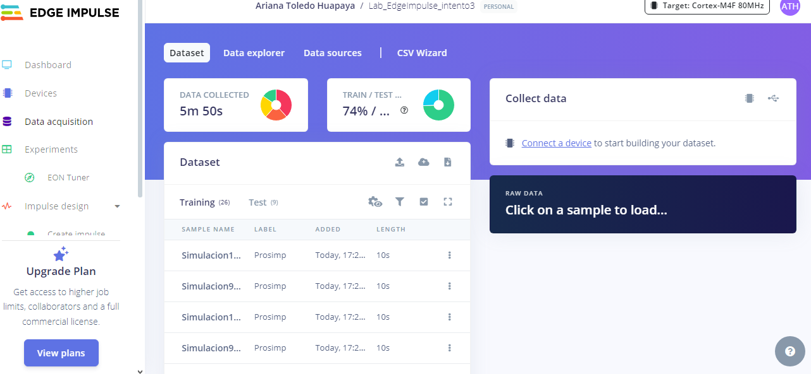
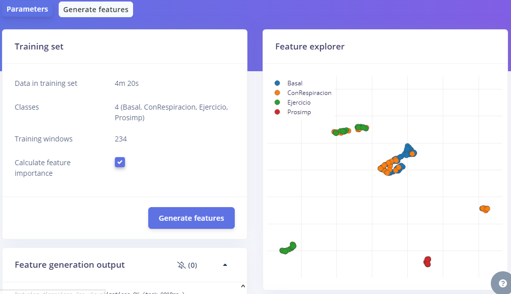
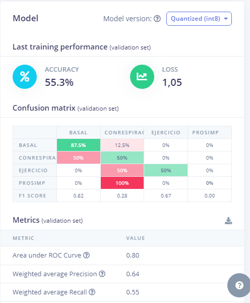
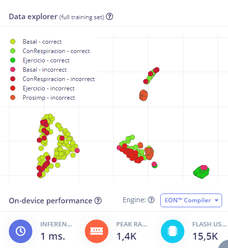

# Laboratorio 12: Generación de Edge Impulse 

## Tabla de Contenidos

1. [Corrección del último laboratorio](#1-Correccióndelúltimolaboratorio)
2. [Create impulse](#2-Createimpulse)
3. [Parámetros](#3-Parámetros)
4. [Clasificación](#4-Clasificación)
5. [Training output](#4-Trainingoutput)

## 1. Corrección del último laboratorio

Se realizó los cambios necesarios para que se pueda obtener 80% de Train y 20% de Test.

  

  

## 2. Create impulse

  

  

## 3. Spectral features
Parámetros:

  

  

## 4. Clasificación:
Parámetros:

  

  

## 5. Training output:
Parámetros:

  

  

  

  

Vemos que el Accuracy es de 55.3% lo cual es bajo aún, debido a que el Accuary debería tener un valor mayor a 95%, esto se debe a que se obtuvo pocos datos en el laboratorio. Lo recomendable es realizar más mediciones para obtener más datos. Por lo tanto,  el modelo de aprendizaje es deficiente. 
